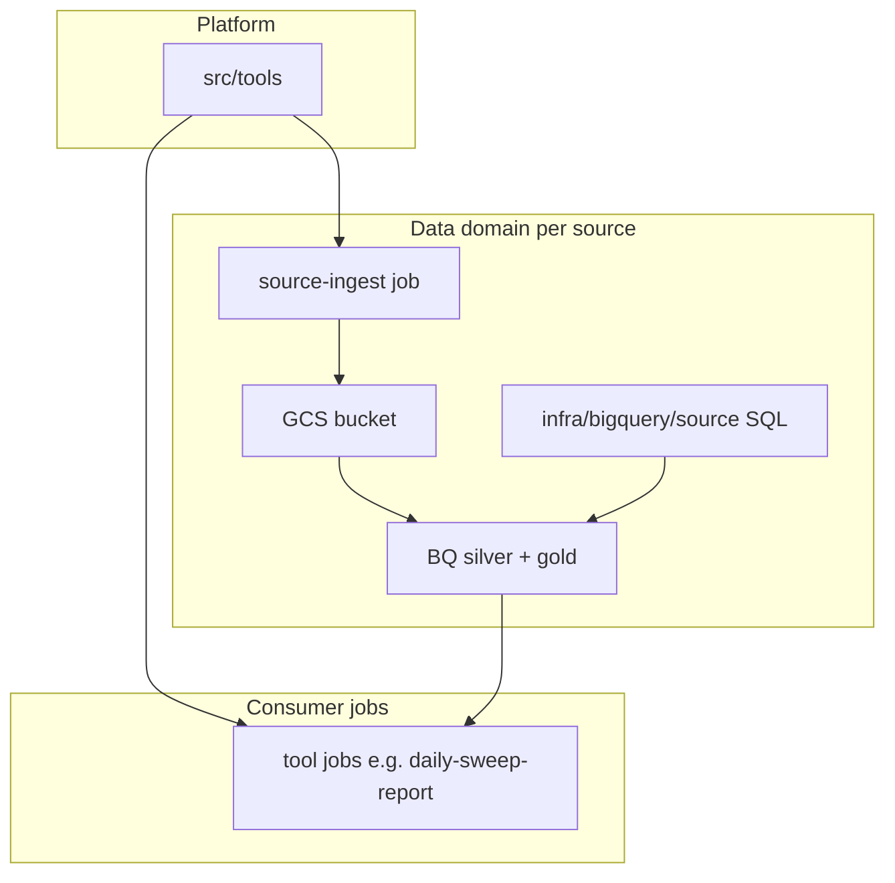

# Architecture

How `tools-gcp` is organized today, where it is heading, and the rules that keep
it from getting convoluted as we add data pipelines and more tools.

## Overview

The repo has three responsibility layers:

| Layer | Location | Purpose |
|-------|----------|---------|
| **Platform** | `src/tools/` | Thin GCP shell: config, Secret Manager helper, FastAPI `/health` + `/ready` |
| **Data domains** | `src/jobs/<source>-ingest/` + `infra/bigquery/<source>/` | Ingest and transform one external system (Linear first) |
| **Consumer jobs** | `src/jobs/<tool-name>/` | Scheduled or CLI tools that read Gold views or run business logic |



## Today (as-built)

- **Cloud Run Service** (`tools-serve`) — health shell deployed from the shared Docker image
- **`daily-sweep-report`** — consumer job; calls Linear API directly today
- **Terraform** — project bootstrap, IAM, secrets containers, WIF deploy
- **No medallion pipeline yet** — BigQuery API enabled, no datasets; no ingest jobs

## Target (Linear — first data domain)

1. **`linear-ingest`** job — Linear GraphQL → GCS Bronze → BigQuery Silver (MERGE SQL)
2. **`linear_gold`** views — tool-facing contract (e.g. `gold_sweep_issues`)
3. **`daily-sweep-report`** reads Gold instead of Linear API
4. **Cloud Run Job + Scheduler** for ingest (~6 AM ET) and sweep (~9 AM ET Mon–Fri)

See the Linear build plan and `infra/bigquery/linear/` for SQL layout.

## Future (multiple sources)

Repeat the **same shape per source** — do not merge into one shared bucket or dataset:

| Source | Ingest job | GCS bucket | BQ datasets |
|--------|------------|------------|-------------|
| Linear | `linear-ingest` | `peq-tools-linear-data` | `linear_bronze`, `linear_silver`, `linear_gold` |
| Epic (later) | `epic-ingest` | separate bucket / possibly separate GCP project | `epic_*` |
| Other | `<source>-ingest` | `<project>-<source>-data` | `<source>_*` |

**Cross-source joins** happen in a **mart layer** (`analytics_gold` views), not by sharing
GCS buckets or chaining ingest jobs. Sources communicate through BigQuery SQL and IAM.

Epic / PHI likely belongs in a **different GCP project** with stricter access — same repo
pattern, not the same bucket as internal SaaS tools.

## Hard rules

1. **Jobs never import from other jobs.** Shared code goes in `src/lib/` only after two
   consumers need it — not in `src/tools/`.
2. **Keep `src/tools/` thin.** Platform helpers only; no pipeline or domain logic.
3. **SQL lives in `infra/bigquery/<source>/`.** DDL, MERGE, and Gold views are SQL files
   executed by Python orchestration — not giant Python string blobs.
4. **Gold is the consumer contract.** Tools query views; they do not read Bronze paths or
   call source APIs once a pipeline exists.
5. **One Secret Manager container per runnable thing.** No shared mega-secret JSON.
6. **IAM scoped per resource.** Ingest SAs write their bucket and Silver; consumers get
   read on Gold (or mart) only.

## Runtime shapes

| Type | Example | Deployed as |
|------|---------|-------------|
| **Service** | FastAPI health shell | Cloud Run **Service** — `make deploy-service` |
| **Batch job** | daily-sweep-report, linear-ingest | Cloud Run **Job** — `make deploy-job JOB=...` |
| **Scheduler** | daily cron | Cloud Scheduler → `:run` on Cloud Run Job |

One Docker image, many entry points (`tools-serve`, `tools-daily-sweep-report`, etc.).

## Repository layout

```
src/
  tools/                    Platform shell (stay small)
  jobs/
    daily-sweep-report/     Consumer job
    linear-ingest/          Pipeline job (planned)
  lib/                      Shared helpers (add when 2+ jobs need them)

infra/
  terraform/                GCP resources and IAM
  bigquery/
    linear/                 Silver DDL/MERGE + Gold views (planned)
    README.md

tests/
  tools/
  jobs/<job_name>/
```

## Adding a new consumer job

See [src/jobs/README.md](../src/jobs/README.md).

## Adding a new data source

1. Create `src/jobs/<source>-ingest/` with `main.py`, client, config, secrets.
2. Add `infra/terraform/<source>_data.tf` — bucket, BQ datasets, secret, job, scheduler.
3. Add `infra/bigquery/<source>/silver/` and `gold/` SQL trees.
4. Add Gold views before repointing any consumer.
5. Extract reusable GCS/BQ helpers to `src/lib/` only if a second ingest job duplicates code.

## Related docs

| Topic | Document |
|-------|----------|
| Job conventions | [src/jobs/README.md](../src/jobs/README.md) |
| Secrets | [SECRETS.md](./SECRETS.md) |
| GCP bootstrap | [GCP_SETUP.md](./GCP_SETUP.md) |
| BigQuery SQL layout | [infra/bigquery/README.md](../infra/bigquery/README.md) |
